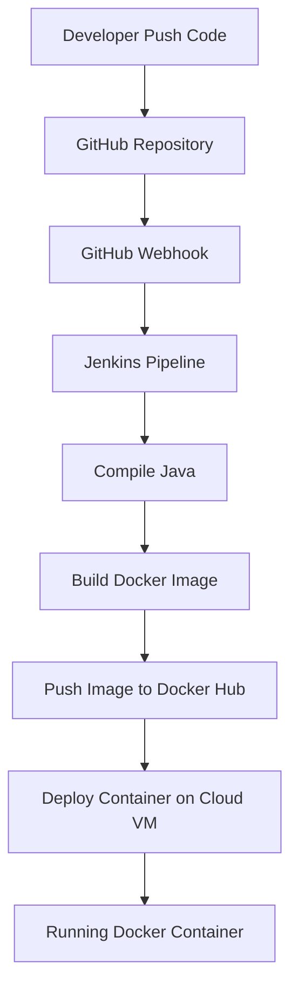

# Jenkins CI/CD Pipeline Project
## CI/CD Architecture

This project demonstrates a simple CI/CD pipeline using Jenkins, Docker, GitHub and Google Cloud.

## Technologies
- Jenkins
- Docker
- Docker Hub
- GitHub
- Java
- Google Cloud VM

## CI/CD Pipeline Workflow

1. Developer pushes code to GitHub
2. GitHub triggers Jenkins via Webhook
3. Jenkins compiles the Java application
4. Jenkins builds a Docker image
5. Docker image is pushed to Docker Hub
6. Jenkins deploys the container on the Cloud VM

## Docker Image

Docker Hub Repository:
https://hub.docker.com/r/abdullah1234567/hello-ci

## Example Output
Hello from Jenkins CI/CD!

